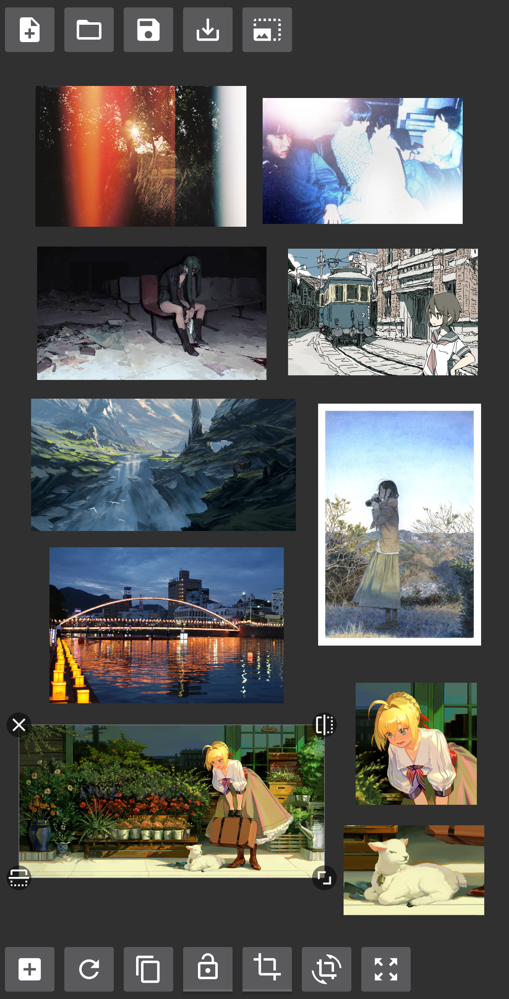

# DroidRef

This is a free and open-source image reference board app for Android, like [PureRef](https://pureref.com) or [VizRef](https://vizref.com). It lets you keep track of a large amount of reference images on an infinite canvas you can pan and zoom. You can crop out only the parts of each image you want to focus on and send pictures from any app that has an image sharing intent.

## Credits

Most of the code was adapted from https://github.com/wuapnjie/StickerView.

## License

MIT.
